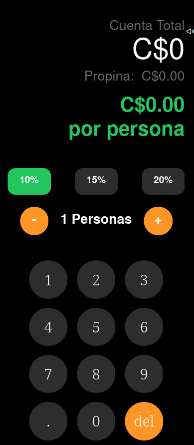

# Tip & Split App 

Aplicación móvil desarrollada con **React Native + Expo** que permite calcular propinas y dividir cuentas entre varias personas de forma rápida e intuitiva.

---

# Características

- Cálculo automático de propinas
- División de cuenta por personas
- Teclado numérico personalizado
- Feedback háptico con `expo-haptics`
- Arquitectura modular
- Uso de Custom Hooks
- Diseño moderno estilo calculadora
- Interfaz responsive usando Flexbox

---

#  Tecnologías Utilizadas

- React Native
- Expo
- TypeScript
- Expo Haptics
- Flexbox
- Custom Hooks

---

#  Estructura del Proyecto

```txt
app/
 └── index.tsx

components/
 ├── CalculatorButton.tsx
 └── TipButton.tsx

constants/
 └── theme.ts

hooks/
 └── useTipCalculator.ts

styles/
 └── global.styles.ts
```

---

#  Instalación

Clonar el repositorio:

```bash
git clone <https://github.com/katia-silva09/S.katia-propina-app.git>
```

Entrar al proyecto:

```bash
cd S.katia-propina-app 
```

Instalar dependencias:

```bash
npm install
```

Instalar Expo Haptics:

```bash
npx expo install expo-haptics
```

---

#  Ejecutar el Proyecto

Iniciar Expo:

```bash
npx expo start
```

Ejecutar en Android:

```bash
npx expo start --android
```

---

#  Arquitectura del Proyecto

La aplicación sigue una arquitectura modular basada en:

## Componentes reutilizables

- `CalculatorButton`
- `TipButton`

## Separación de lógica

Toda la lógica de negocio se encuentra dentro del Custom Hook:

```txt
useTipCalculator.ts
```

Esto permite:

- Mejor mantenimiento
- Reutilización
- Código más limpio
- Separación entre UI y lógica

---

#  Funcionalidades Implementadas

## Construcción dinámica del monto

El teclado numérico personalizado permite construir montos como:

```txt
1 → 15 → 150 → 150.50
```

### Validaciones:
- No permite múltiples puntos decimales
- Manejo correcto del cero inicial

---

## Selección de Propina

Opciones disponibles:

- 10%
- 15%
- 20%

El botón activo cambia visualmente.

---

## División entre Personas

Control tipo contador:

```txt
-   3 Personas   +
```

### Restricción:
- El mínimo es 1 persona

---

## Cálculo en Tiempo Real

Se utiliza `useEffect` para recalcular automáticamente:

- Propina total
- Total por persona

Cada vez que cambia:
- monto
- porcentaje
- número de personas

---

## Feedback Háptico

Se implementó:

```ts
expo-haptics
```

Para brindar respuesta física al usuario en:
- teclado
- botones
- contador

---

# Diseño UI/UX

La interfaz está dividida en 3 secciones:

```txt
┌─────────────────────┐
│ RESULTADOS          │
├─────────────────────┤
│ CONTROLES           │
├─────────────────────┤
│ TECLADO             │
└─────────────────────┘
```

---

# Vista General



# Autor

Desarrollado por Katia Silva ✨